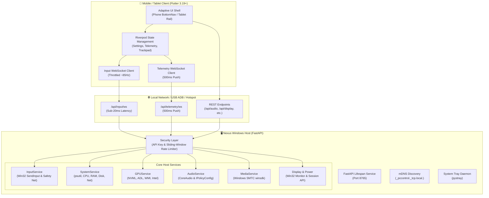

<div align="center">

<!-- Local Neon Gradient Header Banner (100% Reliable, Rendered directly by GitHub) -->
<a href="https://github.com/LOHITHKUMARN/NEXUS-Your-PC.-In-your-hands.">
  
</a>

<br/><br/>

<p align="center">
  
</p>

<p align="center">
  
  
</p>

**A high-performance, real-time PC telemetry dashboard, media controller, and precision remote input suite.**  
Crafted with an adaptive Flutter UI for **Android phones** & **tablets**, backed by an asynchronous **FastAPI Windows Host Service**.

<p align="center">
  <a href="https://flutter.dev"></a>
  <a href="https://fastapi.tiangolo.com"></a>
  <a href="https://python.org"></a>
  <a href="https://microsoft.com/windows"></a>
  <a href="#"></a>
  <a href="#"></a>
  <a href="#"></a>
  <a href="#"></a>
</p>

<p align="center">
  <a href="#-system-overview"><b>🌟 Overview</b></a> •
  <a href="#-adaptive-design--ui-layout"><b>📱 Adaptive UI</b></a> •
  <a href="#-precision-remote-trackpad--virtual-keyboard"><b>🖱️ Trackpad</b></a> •
  <a href="#-real-time-hardware-telemetry"><b>📊 Telemetry</b></a> •
  <a href="#-audio--media-command-deck"><b>🎵 Media</b></a> •
  <a href="#-system-architecture"><b>🏗️ Architecture</b></a> •
  <a href="#-quick-start-guide"><b>🛠️ Quick Start</b></a> •
  <a href="#-connection--pairing-guide"><b>🌐 Connection</b></a> •
  <a href="#-troubleshooting-matrix"><b>❓ Troubleshooting</b></a>
</p>

---

</div>

##  System Overview

**Nexus** transforms your mobile phone or tablet into a futuristic secondary display and command deck for your Windows PC. Whether docked beside your monitor or handheld from across the room, Nexus delivers instant hardware telemetry, low-latency trackpad gestures, media transport controls, and direct system automation over your local network.

```
  ┌─────────────────────────────────────────────────────────────────────────────┐
  │                               N E X U S                                     │
  │                  Unified PC Remote Control & Telemetry                      │
  ├──────────────────────────────────────┬──────────────────────────────────────┤
  │   📱 Mobile Client (Flutter)         │   🖥️ Windows Host Service (FastAPI)  │
  │   • Adaptive UI (Phone & Tablet)     │   • Asynchronous Telemetry Engine    │
  │   • Sub-20ms Trackpad & Gestures     │   • Win32 SendInput & Key Synthesizer│
  │   • Radial Gauges & Live Vitals      │   • Multi-Vendor GPU (AMD/NV/Intel)  │
  │   • Glassmorphic Cyber Theme         │   • Background System Tray Daemon    │
  └──────────────────────────────────────┴──────────────────────────────────────┘
```

---

##  Adaptive Design & UI Layout

Nexus dynamically reconfigures its entire visual interface depending on your device's screen size and orientation:

| Form Factor | Breakpoint | Interface Layout & Highlights |
| :--- | :--- | :--- |
| **📱 Phone** | `< 600dp` *(Portrait-first)* | • One-handed thumb navigation bar with 5 destinations<br>• Single-column vertically scrolling telemetry cards<br>• Paired mini-gauges & full-width sliders<br>• Persistent **Quick Controls** floating trigger (`⚡`) |
| **📟 Tablet / Dock** | `≥ 840dp` *(Landscape docked)* | • Collapsible vertical `NavigationRail`<br>• Multi-column high-density dashboard grid<br>• Large circular radial dials with glow gradients<br>• Split-screen control and media views |

### 🎨 Visual Theme Engine
- **Cyber Dark (Default)**: Deep midnight obsidian base with neon cyan (`#00E5FF`) and electric violet (`#B388FF`) accents with glassmorphic cards (`GlassCard`).
- **Midnight AMOLED**: Pure black background (`#000000`) for OLED power savings and contrast.
- **Midnight Blue**: High-tech enterprise navy aesthetic.

---

##  Precision Remote Trackpad & Virtual Keyboard

- **Dedicated Low-Latency WebSocket (`/api/input/ws`)**: Isolated from the 500ms telemetry pipeline for jitter-free sub-20ms cursor response.
- **Smooth Cursor Dynamics**: Relative mouse displacement with client-side throttle buffer (~85Hz) and adjustable sensitivity (`0.5x`–`3.0x`, default `1.2x`).
- **Multi-Touch Gestures**:
  - `1-Finger Tap` ➔ Left click
  - `2-Finger Tap` ➔ Right click
  - `2-Finger Drag` ➔ Smooth vertical / horizontal scroll
  - `Double-Tap-and-Hold` ➔ Spec-timed drag lock (2 taps within 300ms, hold $\ge 150$ms) with haptic feedback and on-screen status badge.
- **Dedicated Scroll Lane**: Right-edge lane supporting Natural (mobile-style) or Standard mouse wheel modes.
- **Split Ergonomic Buttons**: Ergonomic Left Click (65% width) and Right Click (35% width) with hold-to-drag support.
- **Quick Hotkeys Tray**: 1-tap execution for `Esc`, `Win+D` (Show Desktop), `Alt+Tab` (Task Switcher), `Ctrl+C`, `Ctrl+V`, `Ctrl+Z`, `Enter`, `Backspace`, and `Ctrl+Shift+Esc` (Task Manager).
- **Native Virtual Keyboard Bridge**: Invisible `TextField` bridge to trigger native keyboards (Gboard, Samsung, iOS) with full UTF-16 surrogate pair emoji/symbol injection (`KEYEVENTF_UNICODE`).
- **Disconnect Safety Net**: Server-side held-key tracker automatically dispatches synthetic release events if connection drops, eliminating stuck cursor or modifier keys.

---

##  Real-Time Hardware Telemetry

*Unified 500ms real-time telemetry stream across all your computer's vitals:*

- **CPU**: Real-time utilization %, per-core breakdown, and live frequency (MHz).
- **RAM**: Active memory %, used GB / total physical GB.
- **GPU (Multi-Vendor)**:
  - **AMD Radeon™** via AMD Display Library (ADL) & WMI.
  - **NVIDIA GeForce/RTX** via NVML (`pynvml`).
  - **Intel Arc / UHD Graphics**.
  - Metrics: 3D load %, compute load, dedicated VRAM used/total, and real-time GPU temperature (°C).
- **Disks**: Real-time storage capacity, used space, free GB, and mount status for all drives.
- **Network & Battery**: Live download/upload throughput (KB/s), session bandwidth total, and laptop battery level with charging state.

---

##  Audio & Media Command Deck

- **Master Volume**: Smooth volume slider with mute toggle and $\pm 5\%$ nudging.
- **Audio Output Switcher**: Live switching between headphones, speakers, and external DACs via Windows `IPolicyConfig` COM interface.
- **Media Transport Controls**: Deep integration with Windows System Media Transport Controls (`winsdk`) for Spotify, YouTube, VLC, Apple Music, and web browsers.
- **Now Playing**: Live song title, artist, album, timeline, and real-time album artwork streaming.

---

##  Display & Power Automation

- **Monitor Sleep (`🌙`)**: Instantly blanks the PC display without locking Windows, preserving active background jobs and phone connection.
- **Monitor Wake (`☀️`)**: Instantly brings displays back to life with a single tap.
- **Screen Brightness**: Native hardware brightness slider.
- **Power Operations**: Workstation Lock, Standby Sleep, Reboot, and Power Off with 2-step confirmation dialogs.

---

##  App Launcher & Task Monitor

- **1-Tap Launch**: Pre-configured allowlisted apps (Spotify, Chrome, VS Code, Steam, Discord, Terminal, Task Manager, Calculator) with active running indicators.
- **Process Inspector**: Real-time list of top running processes sorted by RAM and CPU usage.

---

##  Extras & Productivity Tools

- **Remote Clipboard**: Push text directly from your phone into the Windows clipboard.
- **Open URL**: Send web links directly to your PC's default browser.
- **Toast Notifications**: Dispatch native Windows desktop toast notifications from your phone.

---

##  System Architecture



---

##  Quick Start Guide

### 1. Windows Host Backend

> [!NOTE]
> Ensure you have Python 3.10+ installed on your Windows machine.

```powershell
# 1. Navigate to the backend directory
cd backend

# 2. Create and activate virtual environment
python -m venv .venv
.\.venv\Scripts\Activate.ps1

# 3. Install dependencies
pip install -r requirements.txt

# 4. Start the Nexus host service with System Tray icon
python run_server.py

# (Optional: run in headless / CLI mode without tray icon)
python run_server.py --no-tray
```

- **Swagger API Docs**: `http://127.0.0.1:8765/docs`
- **Default Port**: `8765`
- **API Key**: Automatically created and stored in `backend/data/api_key.txt` (also printed in startup console and copied via system tray).

---

### 2. Flutter Mobile / Tablet Client

> [!NOTE]
> Ensure Flutter SDK (3.19+) is configured on your development machine.

```powershell
# 1. Navigate to the frontend directory
cd frontend

# 2. Fetch Flutter dependencies
flutter pub get

# 3. Launch on connected Android device or tablet
flutter run -d <device_id>

# (Optional: preview on Windows desktop or Chrome)
flutter run -d windows
flutter run -d chrome
```

---

##  Connection & Pairing Guide

Nexus offers 4 seamless connection methods depending on your network setup:

```
  ┌─────────────────┬──────────────────────────────────┬───────────────────────────┐
  │ Mode            │ When to Use                      │ Host IP in Nexus App      │
  ├─────────────────┼──────────────────────────────────┼───────────────────────────┤
  │ 📶 Wi-Fi (LAN)  │ Home / Private Wi-Fi Router      │ Select detected Wi-Fi IP  │
  │ 📡 Hotspot      │ Public / College Wi-Fi Isolation │ 192.168.137.1             │
  │ 🔌 USB (ADB)    │ Zero Wi-Fi / Ultra-low Latency   │ 127.0.0.1 (Local)         │
  │ 💻 Emulator     │ Android Studio Local Testing     │ 10.0.2.2 (Emulator)       │
  └─────────────────┴──────────────────────────────────┴───────────────────────────┘
```

<details>
<summary><b>View detailed step-by-step instructions for each mode</b></summary>

### Option A: Connect via Local Wi-Fi (Recommended for Home)
1. Verify both PC and phone are on the **same Wi-Fi network**.
2. Open the Nexus mobile app and navigate to **Tools & Config** (`Settings`).
3. Tap the detected PC IP chip (or enter your PC's local IPv4 address).
4. Enter your Port (`8765`) and API Key from `backend/data/api_key.txt`.
5. Tap **Save Settings** or **Test Connection**.

### Option B: Connect via Windows Mobile Hotspot
*Ideal for university or corporate networks with client isolation:*
1. On your PC, activate **Mobile Hotspot** in Windows Settings.
2. Connect your mobile device to your PC's hotspot network.
3. In the Nexus mobile app, set **PC Host IP** to `192.168.137.1`.
4. Tap **Save Settings**.

### Option C: Connect via USB Cable (ADB Reverse Port Forwarding)
*Ideal for zero-wireless interference and lowest possible latency:*
1. Connect phone via USB with **USB Debugging** enabled.
2. Run in PowerShell:
   ```powershell
   adb reverse tcp:8765 tcp:8765
   ```
3. In Nexus mobile app, tap the **`127.0.0.1 (Local)`** quick chip and tap **Save Settings**.

### Option D: Android Studio Emulator
- Tap the **`10.0.2.2 (Emulator)`** chip (routes to `127.0.0.1` on the host PC).

</details>

---

##  Windows Firewall Setup

Windows Defender Firewall may block inbound traffic to Python by default.

> [!TIP]
> **Automatic 1-Click Fix**: Navigate to `backend/`, right-click **`allow_firewall.bat`**, and select **"Run as administrator"**.

### Manual PowerShell Fix
Open **PowerShell as Administrator** and run:
```powershell
# Remove blocking rule created by Windows Firewall dialog
Remove-NetFirewallRule -DisplayName "python.exe" -ErrorAction SilentlyContinue

# Allow Nexus port 8765 inbound
New-NetFirewallRule -DisplayName "Nexus PC Control Port 8765" -Direction Inbound -Action Allow -Protocol TCP -LocalPort 8765
```

---

##  Troubleshooting Matrix

| Issue | Root Cause | Solution |
| :--- | :--- | :--- |
| **Connection refused** | Windows Firewall blocking inbound traffic to Python. | Run `backend/allow_firewall.bat` as Administrator. |
| **WebSocket 403 Forbidden** | Server running an older cached build without updated endpoints. | Restart the host backend server (`python run_server.py`). |
| **Connection timed out** | Phone and PC on separate subnets or Wi-Fi Client Isolation is active. | Switch to **Windows Mobile Hotspot** (`192.168.137.1`) or connect to the same 2.4/5GHz Wi-Fi band. |
| **401 Unauthorized** | The API Key in app settings does not match the server's key. | Copy key from `backend/data/api_key.txt` or right-click system tray icon ➔ "Copy API Key". |
| **Network Profile Public** | Windows disables network discovery on Public networks. | Set Wi-Fi Network Profile to **Private** in Windows Settings. |
| **Media controls not updating** | Active player lacks Windows SMTC support. | Ensure Spotify, VLC, Chrome, Edge, or a supported player is running. |

---

##  Security Architecture

- **Zero-Configuration mDNS**: Advertises `_pccontrol._tcp.local.` on the local subnet for effortless phone discovery.
- **Pre-Shared API Key Authentication**: Pre-shared token required for all REST endpoints (`X-API-Key` header) and WebSocket connections.
- **Log Credential Redaction**: Server automatically scrubs the `api_key` query parameter from terminal outputs and access logs.
- **Sliding-Window Brute-Force Rate Limiter**:
  - Monitors failed auth attempts within a 60-second sliding window.
  - Exceeding **5 failures** triggers an automatic **300-second lockout** (`HTTP 429 Too Many Requests`).
  - Input event streaming (`move`, `scroll`) runs on an isolated high-throughput channel with zero dropped packets.
- **On-Demand Key Rotation**: Instant key rotation via the PC system tray menu or `POST /api/auth/rotate-key`.
- **Allowlisted Execution**: Restricts execution to explicitly pre-approved applications defined in `backend/app/config.py`.

---

##  Automated Testing

### Backend Unit & Integration Tests (Pytest)
```powershell
cd backend
.\.venv\Scripts\pytest.exe -v
```
- Validates REST endpoints, authentication lockout, pairing URIs, Win32 input translation, emoji UTF-16 surrogate pairs, and disconnect safety nets.

### Frontend Widget & Logic Tests (Flutter)
```powershell
cd frontend
flutter test
```
- Validates FormFactor adaptive layout breakpoints, ResourceGauge circular/compact rendering, AppTheme palettes, and Trackpad throttling buffers.

---

##  Project Structure

```text
bat_desk/
├── backend/
│   ├── app/
│   │   ├── core/            # Security, auth, rate limiting & WebSocket manager
│   │   ├── models/          # Pydantic telemetry & input schemas
│   │   ├── routers/         # Telemetry, audio, media, display, power, apps, extras, input
│   │   ├── services/        # System, GPU (AMD/NV/Intel), audio, media, display, power, Win32 SendInput
│   │   ├── config.py        # Configuration, IP resolution, app allowlist
│   │   ├── main.py          # FastAPI application & lifespan management
│   │   └── tray.py          # Windows System Tray daemon (pystray)
│   ├── tests/               # Pytest suite (API, security, input translation)
│   ├── allow_firewall.bat   # Auto-elevating Windows Firewall script
│   ├── requirements.txt     # Python backend dependencies
│   └── run_server.py        # Host server launcher
└── frontend/
    ├── lib/
    │   ├── core/            # Theme, Riverpod providers, API client, WebSockets
    │   ├── features/
    │   │   ├── dashboard/   # Live system dials, mini-gauges, quick power actions
    │   │   ├── control_center/ # Volume, brightness, display sleep/wake, power actions
    │   │   ├── media/       # Now playing card, album artwork, playback controls
    │   │   ├── apps/        # Allowlisted app launcher & active task manager
    │   │   ├── trackpad/    # Remote trackpad, scroll lane, hotkey tray, virtual keyboard
    │   │   └── settings/    # LAN discovery, host IP config, API key, themes
    │   └── shared/widgets/  # GlassCard, ResourceGauge, CustomSlider, QuickActionsSheet
    ├── test/                # Flutter unit and widget tests
    └── pubspec.yaml         # Flutter dependencies & assets
```

---

<div align="center">

<!-- Local Footer Gradient Line (100% Reliable, Rendered directly by GitHub) -->


<br/>

**⚡ Nexus** • Built with ❤️ using Flutter & FastAPI

</div>